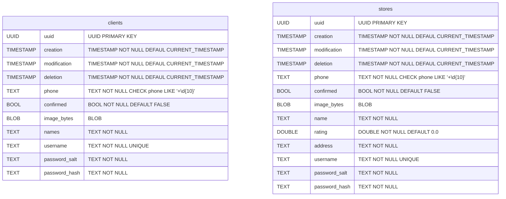
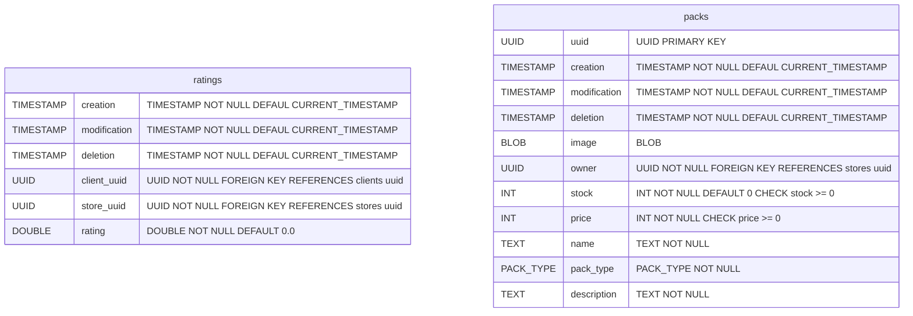
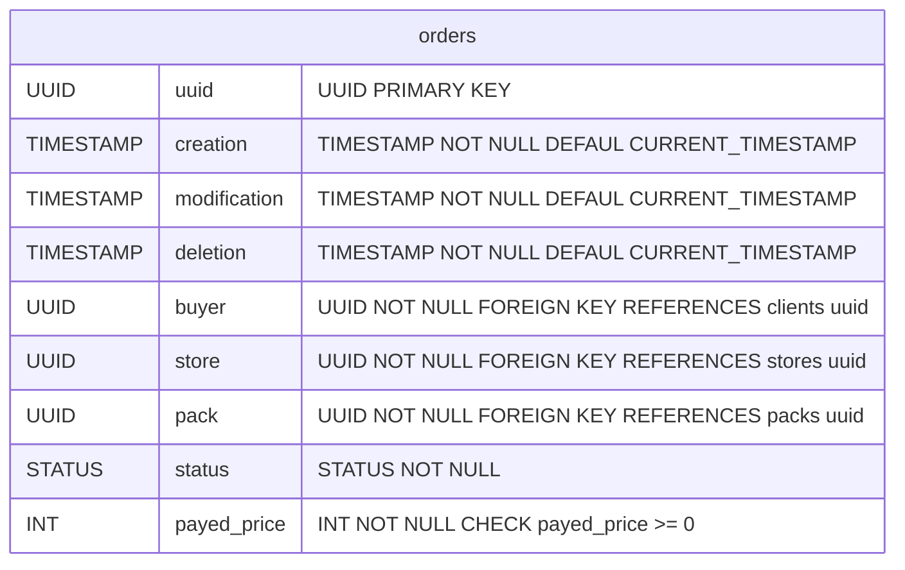
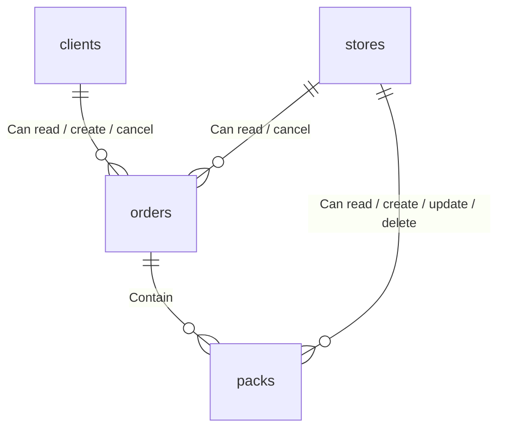
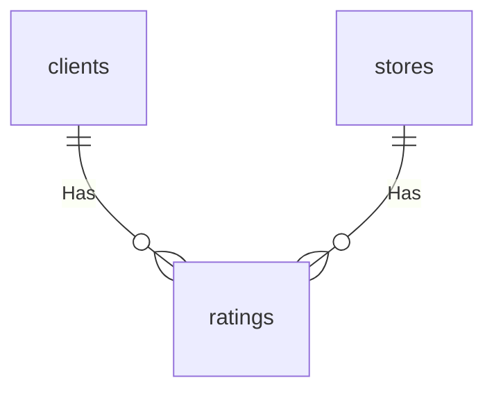

# Database

This document describes the database present on dealer.

### Tables

### Relations

#### Order system

#### Rating system

## Cache

Dealer uses any `redis` like cache to store user sessions in the format `random_key:user_uuid`