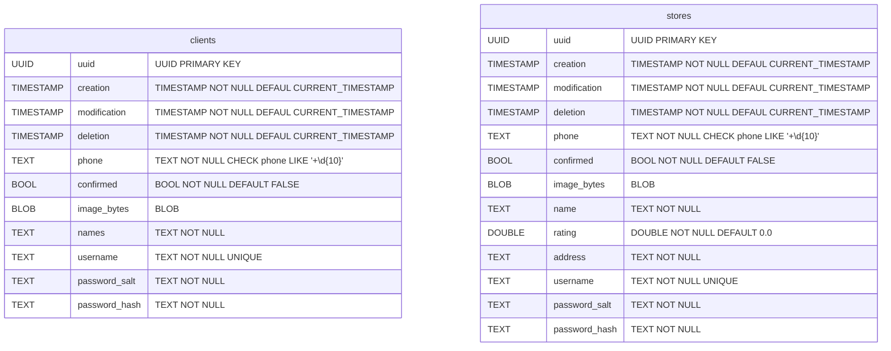
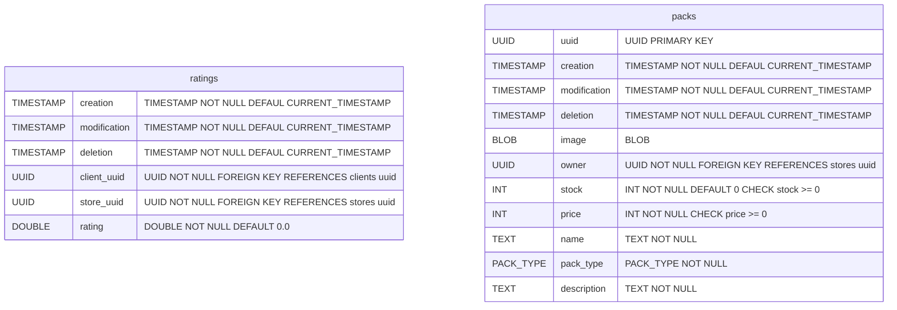
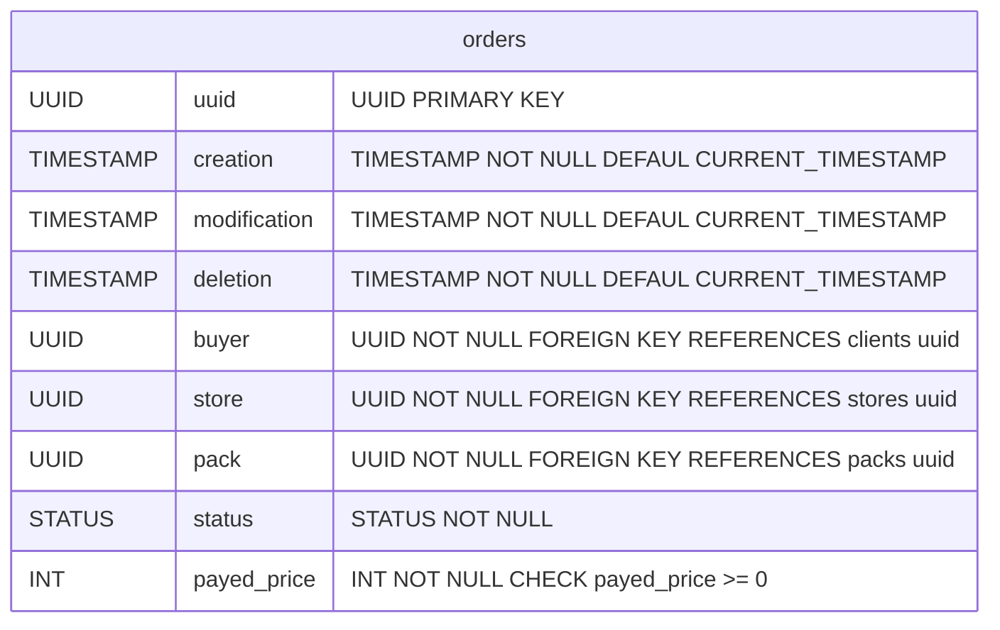
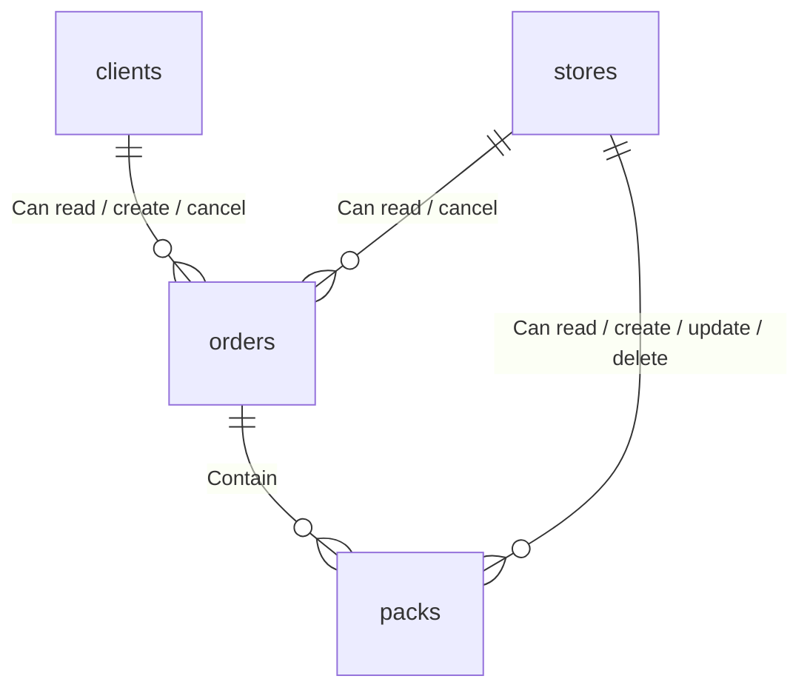
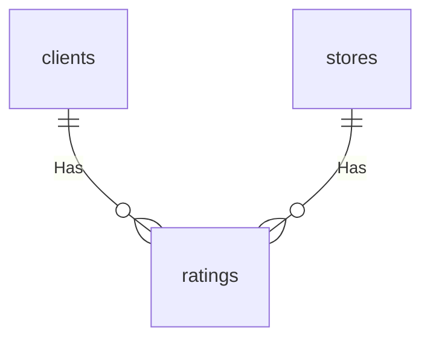

# Database

This document describes the database present on dealer.

### Tables

### Relations

#### Order system

#### Rating system

#### Triggers

| Name                           | Table     | On              | Description                                        |
| ------------------------------ | --------- | --------------- | -------------------------------------------------- |
| `clients_update`               | `clients` | `BEFORE UPDATE` | Updates **modification** column                    |
| `stores_update`                | `stores`  | `BEFORE UPDATE` | Updates **modification** column                    |
| `ratings_update`               | `ratings` | `BEFORE UPDATE` | Updates **modification** column                    |
| `refresh_ratings_value_update` | `ratings` | `AFTER UPDATE`  | Refreshes the **rating** column of stores          |
| `refresh_ratings_value_insert` | `ratings` | `AFTER INSERT`  | Refreshes the **rating** column of stores          |
| `packs_update`                 | `packs`   | `BEFORE UPDATE` | Updates **modification** column                    |
| `orders_update`                | `orders`  | `BEFORE UPDATE` | Updates **modification** column                    |
| `orders_protect_trigger`       | `orders`  | `BEFORE UPDATE` | Protects the order of been updated more than once. |

#### Functions and Procedures

| Name                       | Arguments                                                    | Output                | Description                                                |
| -------------------------- | ------------------------------------------------------------ | --------------------- | ---------------------------------------------------------- |
| `clients_register`         | `phone_v TEXT`, `names_v TEXT`, `username_v TEXT`, `password_v TEXT` | **None**              | Register a new client in the database                      |
| `clients_login`            | `username_v TEXT`, `passw_v TEXT`                            | Client's UUID OR NULL | Login the client, on success returns the UUID on fail NULL |
| `clients_update_phone`     | `uuid_v UUID`, `phone_v TEXT`                                | **None**              | Updates the client's phone                                 |
| `clients_confirm`          | `uuid_v UUID`                                                | **None**              | Confirms the Client's account                              |
| `clients_update_image`     | `uuid_v UUID`, `image_v BYTEA`                               | **None**              | Updates  the Client's image                                |
| `clients_update_names`     | `uuid_v UUID`, `names_v TEXT`                                | **None**              | Updates Client's names                                     |
| `clients_update_password`  | `uuid_v UUID`, `old_password TEXT`, `new_password_v TEXT`    | **None**              | Updates Client's password                                  |
| `stores_register`          | `phone_v TEXT`, `name_v TEXT`, `address_v TEXT`, `username_v TEXT`, `password_v TEXT` | **None**              | Register a new Store                                       |
| `stores_login`             | `username_v TEXT`, `passw_v TEXT`                            | Store's UUID OR NULL  | Login the store, on success returns the UUID on fail NULL  |
| `rate_store`               | `client_uuid_v UUID`, `store_uuid_v UUID`, `rating_v DOUBLE PRECISION` | **None**              | Procedure used to rate store                               |
| `stores_update_phone`      | `uuid_v UUID`, `phone_v TEXT`                                | **None**              | Updates Store's phone                                      |
| `stores_confirm`           | `uuid_v UUID`                                                | **None**              | Confirms store account                                     |
| `stores_update_image`      | `uuid_v UUID`, `image_v BYTEA`                               | **None**              | Updates Store's image                                      |
| `stores_update_name`       | `uuid_v UUID`, `name_v TEXT`                                 | **None**              | Updates Store's name                                       |
| `stores_update_address`    | `uuid_v UUID`, `address_v TEXT`                              | **None**              | Updates Store's address                                    |
| `stores_update_password`   | `uuid_v UUID`, `old_password_v TEXT`, `new_password_v TEXT`  | **None**              | Updates store account password                             |
| `stores_create_packs`      | `store_uuid_v UUID`, `name_v TEXT`, `description_v TEXT`, `stock_v INT`, `price_v INT`, `pack_type_v PACK_TYPE` | **None**              | Store operation to create a pack                           |
| `stores_delete_pack`       | `store_uuid_v UUID`, `pack_uuid UUID`                        | **None**              | Delete the pack owned by the store                         |
| `packs_update_image`       | `uuid_v UUID`, `image_v BYTEA`                               | **None**              | Updates the image of the pack                              |
| `packs_update_name`        | `uuid_v UUID`, `name_v TEXT`                                 | **None**              | Updates the name of the pack                               |
| `packs_update_description` | `uuid_v UUID`, `description_v TEXT`                          | **None**              | Updates the description of the pack                        |
| `packs_update_price`       | `uuid_v UUID`, `price_v INT`                                 | **None**              | Updates the price of the pack                              |
| `packs_update_stock`       | `uuid_v UUID`, `stock_v TEXT`                                | **None**              | Updates the stock of the pack                              |
| `clients_create_order`     | `client_uuid_v UUID`, `pack_uuid_v UUID`                     | **None**              | Client operation for creating and order for a pack         |
| `clients_cancel_order`     | `client_uuid UUID`, `order_uuid UUID`                        | **None**              | Client operation to cancel an order                        |
| `stores_cancel_order`      | `stores_uuid UUID`, `order_uuid UUID`                        | **None**              | Store operation to cancel an order                         |
| `stores_complete_order`    | `stores_uuid UUID`, `order_uuid UUID`, `code_v UUID`         | **None**              | Store operation to complete an order                       |

## Cache

Dealer uses any `redis` like cache to store user sessions in the format `random_key:user_uuid`